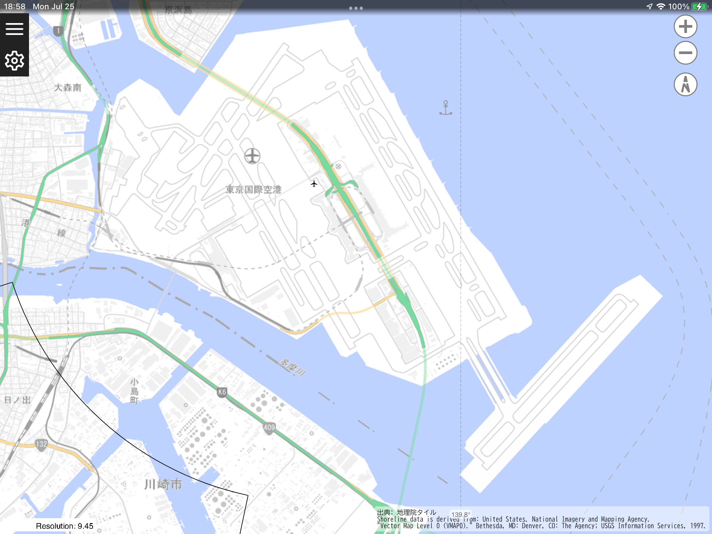
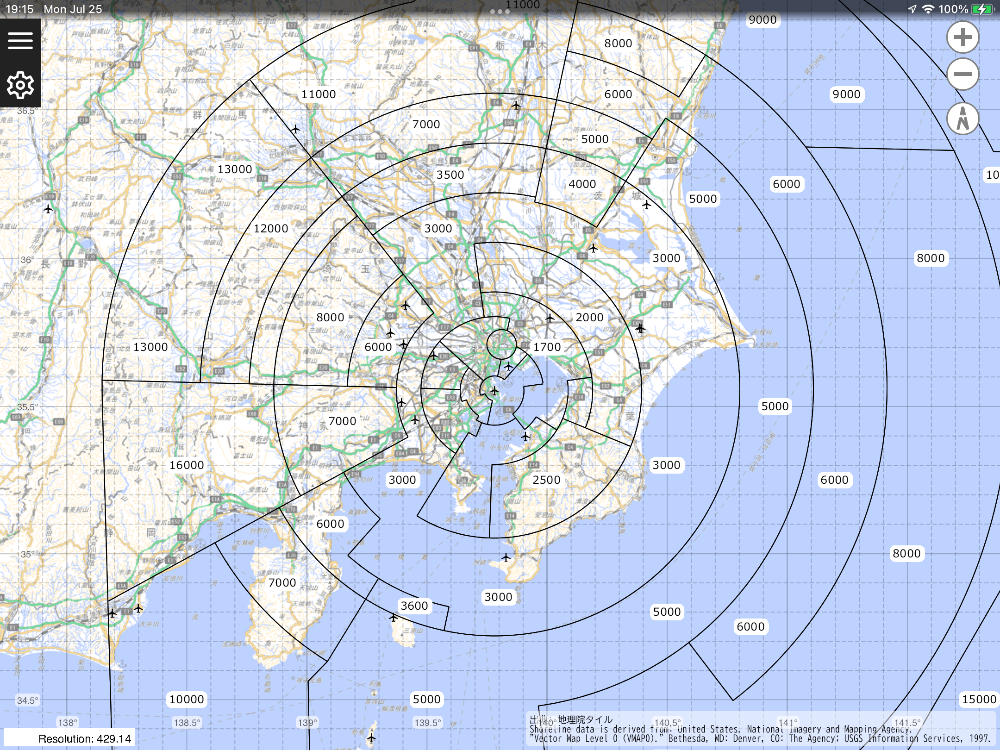
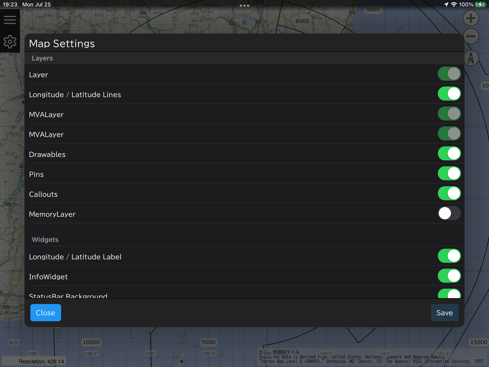
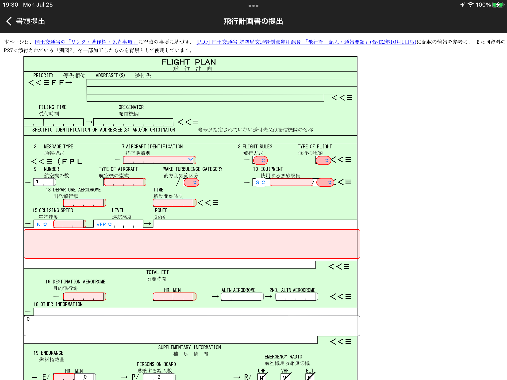
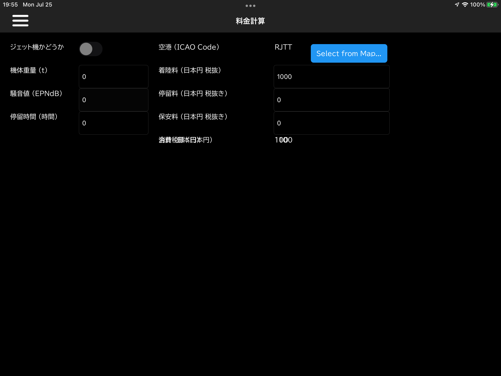

# AirTote

Japanese (Unofficial) Flight Information Service

_日本の小型機パイロットに革命を！_

- フライトの度に、事務所のパソコンと睨めっこしていませんか？
- 色々なところにある資料をまとめて、また組み合わせてフライトプランを練る作業、疲れませんか？
- わかりにくい公式資料に嫌気がさしたことはありませんか？
- 空港事務所まで行って書類提出、対面かつ現金での使用料支払いetc... 大変じゃないですか？

AirToteで苦労とおさらばしましょう！ **あなたの翼はもう自由です！**

<iframe width="560" height="315" src="https://www.youtube-nocookie.com/embed/asBaW7ni6dc" title="YouTube video player" frameborder="0" allow="accelerometer; autoplay; clipboard-write; encrypted-media; gyroscope; picture-in-picture" allowfullscreen></iframe>

## 1. All in One Map

アプリを開くと、いちばん初めに地図が表示されます！

地図には、フライトに必要な全ての情報が表示されます。

---

空港のアイコンをタップすることで、ICAOコードと空港名、METAR/TAF/ATISを確認できます！
(上記画像において、ATIS表示機能は未実装です)

さらに、吹き出し(Callout)をタップすることで、その空港の詳細情報を確認できます。

---

空港にズームすることにより、滑走路や誘導路、駐機場の位置や使用状況などの**設備情報を確認**できます！
(上記画像において、各機能は未実装です)

---

プランニング中はもちろん、飛行中にも役に立つ航空路/MVA等も表示！
(上記画像において、航空路、およびRJTT(羽田空港)以外のMVAは未実装です)

---

緯度経度の表示は要らない？ MVAが邪魔？
そんなときのために、各表示は個別にOn/Off可能です！

---

もちろん、各情報は最新のものに自動的に更新されます。(設備情報や航空路、MVA等については、最新情報を有料で配信する形に変更する可能性があります)

ほか、周辺の航空機位置情報を表示する機能も計画中です。

## 2. Create / Submit Papers

飛行計画書の記入、毎回毎回手書きは面倒ではありませんか？

AirToteで飛行計画書を**デジタル化**しましょう！

(上記画像は開発中のものであり、将来的にインターフェイスが大きく変わる可能性があります)

AirToteで作成すれば、自身の機体に関する情報は保存されて次回以降自動で入力されるほか、過去に作成したものを複製して使用することも可能です！

作成した飛行計画書は、直接プリンターで印刷したり、PDF化して保存したり、あるいは対応している空港ではAirToteから**直接空港事務所に提出**できます！

## 3. Calculator

飛行時間、燃料消費量、風の影響etc... プランニング中に行う計算も、飛行中に行う計算も、AirToteひとつで可能になります！

(上記画像は開発中のものであり、将来的にインターフェイスが大きく変わる可能性があります)

飛行中に入力するのは大変? 音声アシスタントを用いた計算の音声入力機能の実装を計画中です！

## 4. Digital Handbook (計画中)

「あれ何だったっけ？」「こういうときどうするんだっけ？」

フライトに必要な情報は全て覚えているのが当たり前ですが、それでも人間、忘れてしまうこともあります。
そんなときのために、AirToteから各種情報を参照できるようにします！

(計画中につき、何を収録するかは未定です。)

## 5. Pay Charges (計画中)

空港に着陸する度に、空港事務所に行って空港使用料を支払に行って戻って…
AirToteを使えば、対応した空港での支払いを機内から実行でるようになります！ (計画中につき、どの空港で使用可能になるか等は未定です。)

## 動作環境

パソコンでも、スマホでも、タブレットでも。
同じ機能を全てのデバイスで使用可能！

以下のOSをサポート予定です。

- Android (5.0: Lolipop ~ )
- iOS (10.0 ~ ) (iOS 14.2未満では一部挙動が異なる場合があります)
  - iPhone 5以上
- Windows (10.0.17763 ~ )

(各OSの名称およびデバイス名は、各社の登録商標です)
